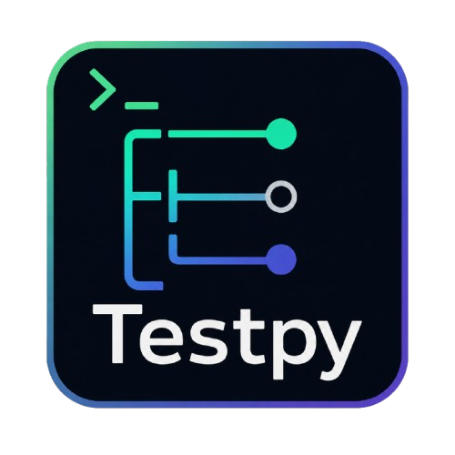

<div align="center">



# Testpy

**A terminal workspace for discovering, selecting, and running tests across multiple languages and frameworks.**

<p>
  
  
  
</p>

</div>

---

Testpy provides a unified terminal workspace for discovering, selecting, running, and monitoring tests across multiple languages and testing frameworks.

Instead of remembering framework-specific commands, switching terminals, and manually tracking failures, Testpy keeps the entire workflow in one place.

<h2>Framework Support</h2>

<h3>Supported</h3>

<p>
  
  
  
</p>

<h3>Planned</h3>

<p>
  
  
  
  
  
  
</p>

## Features

- Tree-based test discovery
- Multi-selection support
- Unified output view
- Command mode
- Keyboard-driven workflow
- Project configuration via `testpy.toml`
- Terminal User Interface (TUI)
- Headless execution mode

## Workflow

```text
Discover Tests
      │
      ▼
Select Tests
      │
      ▼
Run Tests
      │
      ▼
View Results
      │
      ▼
Run Failed Tests
```

## Installation

```bash
pip install testpy
```

## Development

```bash
poetry install

poetry run pytest
poetry run testpy

poetry build
```

## Documentation

<table width="100%">
<tr>
    <th align="left">Document</th>
    <th align="left">Description</th>
</tr>

<tr>
    <td><a href="docs/configuration.md">Configuration</a></td>
    <td>Configure Testpy</td>
</tr>

<tr>
    <td><a href="docs/keybindings.md">Keybindings</a></td>
    <td>Keyboard shortcuts</td>
</tr>

<tr>
    <td><a href="docs/commands.md">Commands</a></td>
    <td>Command mode reference</td>
</tr>

<tr>
    <td><a href="docs/cli.md">CLI</a></td>
    <td>Command-line arguments</td>
</tr>

<tr>
    <td><a href="docs/frameworks.md">Framework Support</a></td>
    <td>Supported frameworks</td>
</tr>

<tr>
    <td><a href="docs/roadmap.md">Roadmap</a></td>
    <td>Development roadmap</td>
</tr>

<tr>
    <td><a href="docs/future.md">Future Ideas</a></td>
    <td>Post-v1 ideas</td>
</tr>

<tr>
    <td><a href="CONTRIBUTING.md">Contributing</a></td>
    <td>Contribution guide</td>
</tr>
</table>

## License

Apache License 2.0 [read here](./LICENSE)
